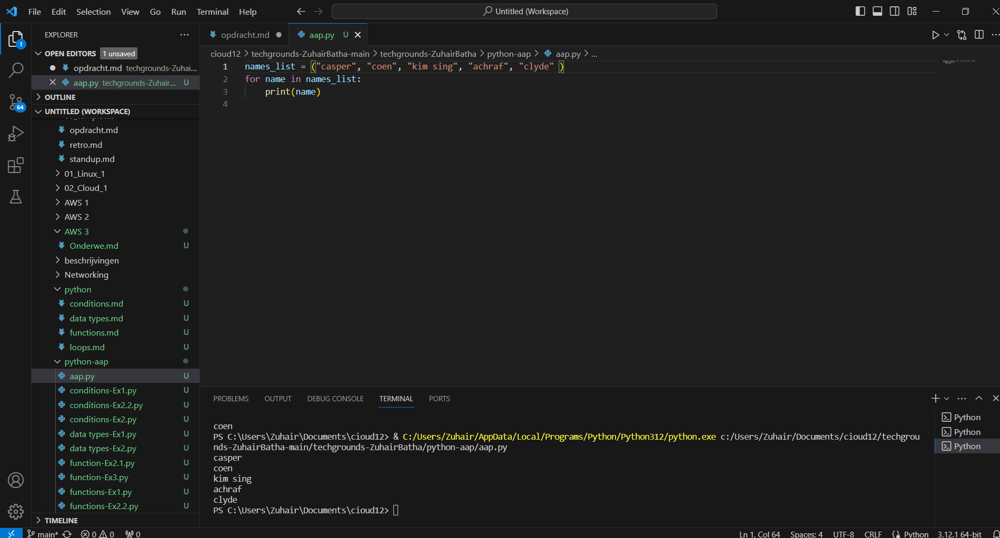
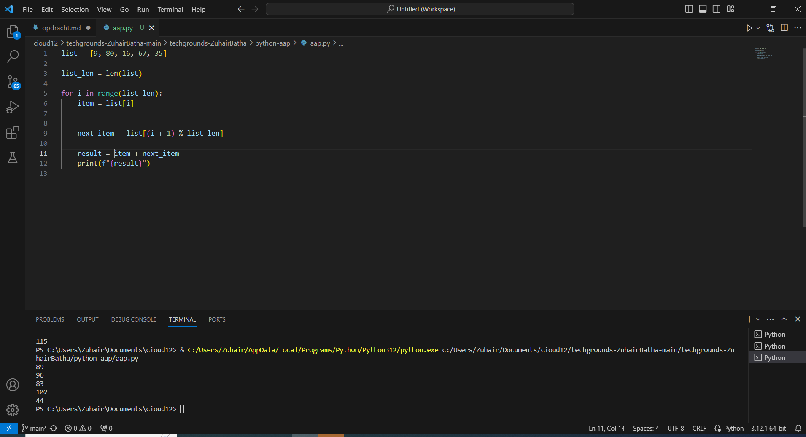

# [Lists]
[In Python, a list is a versatile and mutable data structure used to store an ordered collection of items. Lists are defined by enclosing the elements in square brackets ([]) and separating them with commas.]

## Key-terms
[Schrijf hier een lijst met belangrijke termen met eventueel een korte uitleg.]

## Opdracht
# Exercise 1:
 - Create a new script.
 - Create a variable that contains a list of five names.
 - Loop over the list using a for loop. Print every individual name in the list on a new line.
# Exercise 2:
 - Create a new script.
 - Create a list of five integers.
 - Use a for loop to do the following for every item in the list:
 . Print the value of that item added to the value of the next item in the list.
 . If it is the last item, add it to the value of the first item instead (since there is no next item).
 - The first result above is created by adding 9 and 80. The second result is created by adding 80 and 16, etc. The last result is created by adding 35 and 9.
### Gebruikte bronnen
[https://www.youtube.com/watch?v=kXKcuqISXYo&list=PLuXY3ddo_8nzrO74UeZQVZOb5-wIS6krJ&index=24]
[https://www.youtube.com/watch?v=jWsx8C_uVCo]
[https://www.digitalocean.com/community/tutorials/python-for-loop-example]

### Ervaren problemen
[geen]

### Resultaat
[gelukt]

