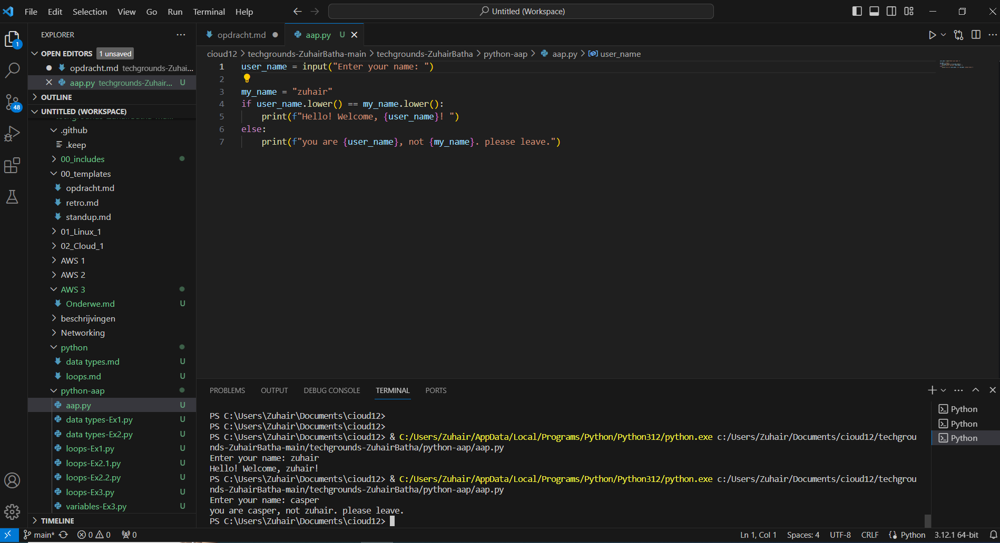
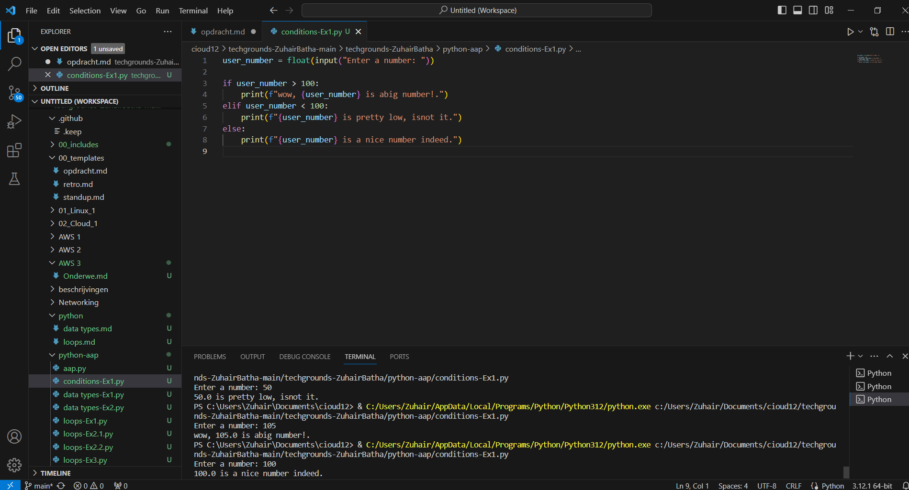
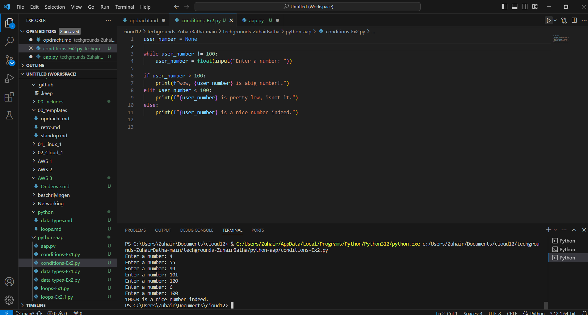

# [conditions]
[conditional statements are used to make decisions in your code based on certain conditions. The two main types of conditional statements are if statements and else statements. Additionally, there is the elif statement, which is short for "else if" and is used for multiple conditions.]

## Key-terms
[if, elif, and else]

## Opdracht
# Exercise 1:
 - Create a new script.
 - Use the input() function to ask the user of your script for their name. If the name they input is your name, print a personalized welcome message. If not, print a different personalized message.
 # Exercise 2:
 - Create a new script.
 - Ask the user of your script for a number. Give them a response based on whether the number is higher than, lower than, or equal to 100.
### Gebruikte bronnen
[https://www.youtube.com/watch?v=FvMPfrgGeKs]

### Ervaren problemen
[geen]

### Resultaat
[gelukt]

