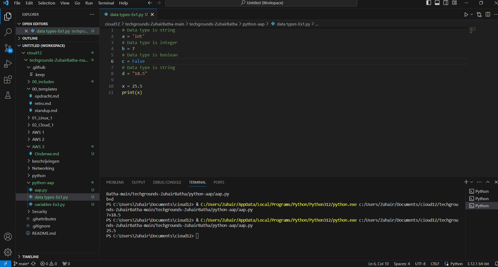
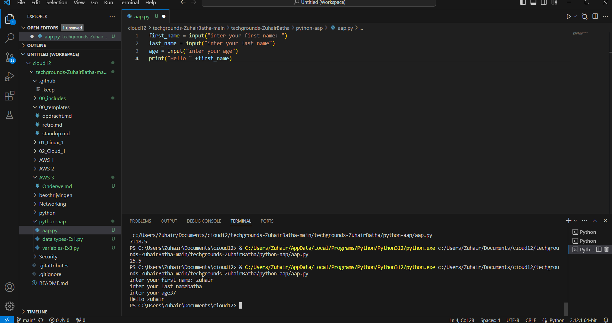

# [Datatypesandcomments]
[Data types are fundamental building blocks of Python programs. They represent different kinds of information that a program can handle.]

## Key-terms
* mboolean
A binary state that is either True or False.
boolean = True
* String
Technically an array of characters. Strings are denoted using “ ” double quotes or ‘ ’ single quotes.
string = "This is a string"
* Int
An integer is a whole number. Ints can be both positive and negative.
integer = 6
* Float
A floating-point number is a decimal number.
floating_point = 18.5

## Opdracht
# Exercise 1:
 - Create a new script.
 - Copy the code below into your script.
 - a = 'int'

 - b = 7

 - c = False

 - d = "18.5"

 - Determine the data types of all four variables ( a, b, c, d) using a built-in function.
  - Make a new variable x and give it the value b + d. Print the value of x. This will raise an error. Fix it so that print(x) prints a float.
 - Write a comment above every line of code that tells the reader what is going on in your script.
 # Exercise 2:
 - Create a new script.
 - Use the input() function to get input from the user. Store that input in a variable.
 - Find out what data type the output of input() is. See if it is different for different kinds of input (numbers, words, etc.).
### Gebruikte bronnen
[https://www.youtube.com/watch?v=XKHEtdqhLK8]

### Ervaren problemen
[geen]

### Resultaat
[gelukt.]

