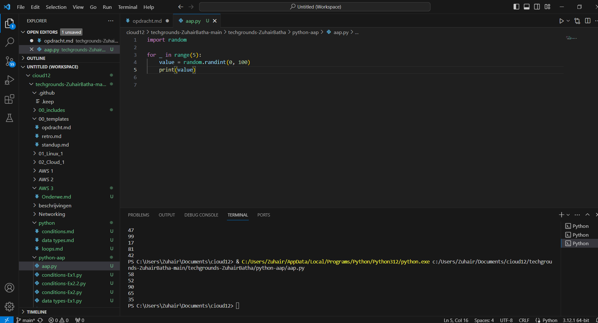
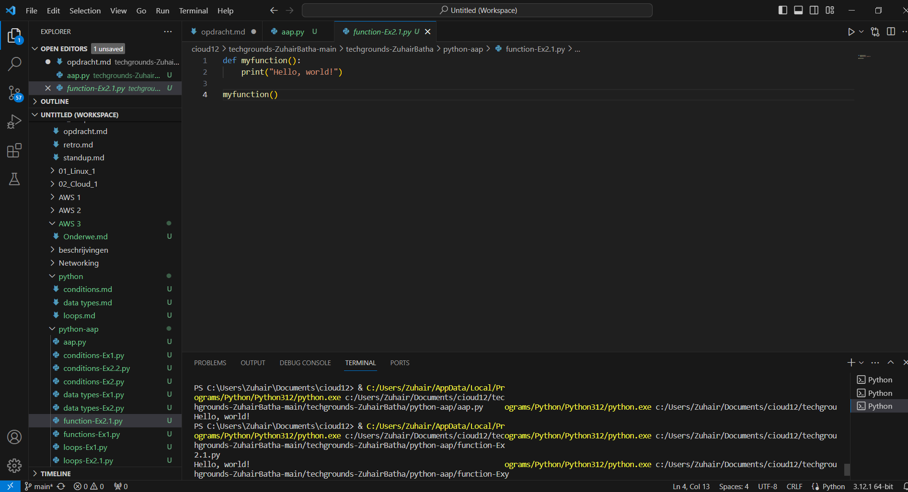
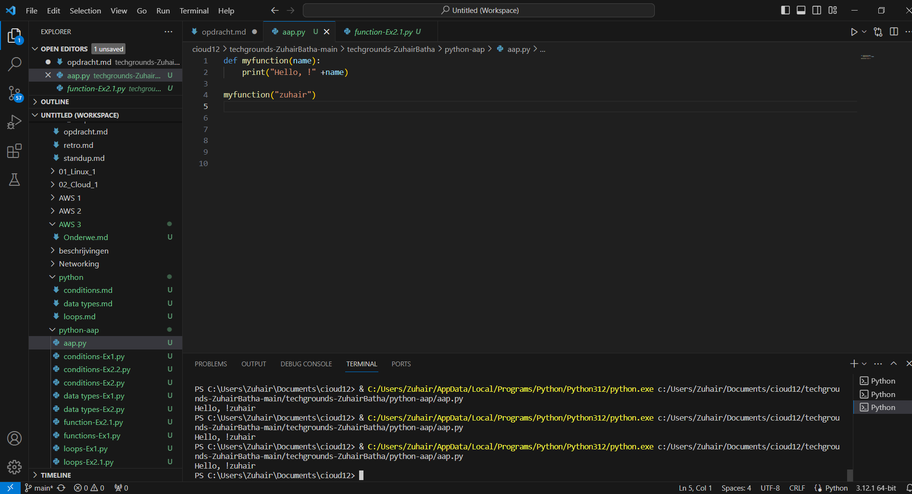
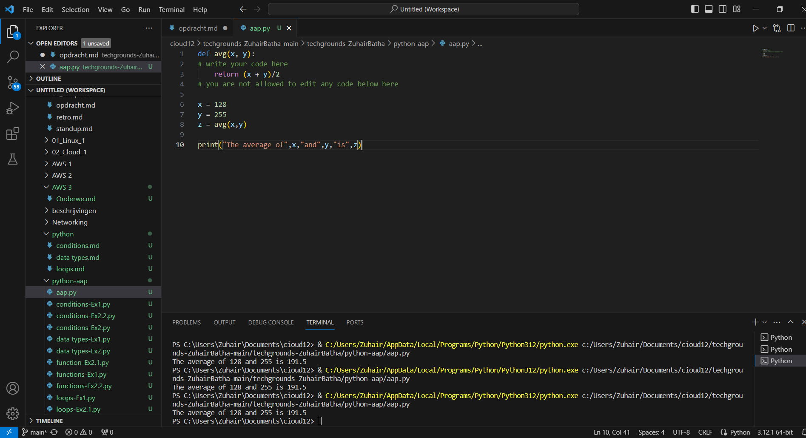

# [functions]
[functions are blocks of reusable code that perform a specific task. Functions help organize code into manageable and modular pieces, making it easier to read, understand, and maintain.]

## Key-terms
* print()	Prints to the standard output device.
* range()	Returns a sequence of numbers, starting from 0 and increments by 1 (by default)
* round()	Rounds a numbers
* input()	Allowing user input
* help()	Executes the built-in help system
* clear()	Removes all the elements from the lis

## Opdracht
# Exercise 1:
 - Create a new script.
 - Import the random package.
 - Print 5 random integers with a value between 0 and 100.
# Exercise 2:
 - Create a new script.
 - Write a custom function myfunction() that prints “Hello, world!” to the terminal. Call myfunction.
 - Rewrite your function so that it takes a string as an argument. Then, it should print “Hello, NAME!”.
 # Exercise 3:
 - Create a new script.
 - Copy the code below into your script.

def avg():
#write your code here
#you are not allowed to edit any code below here

x = 128
y = 255
z = avg(x,y)

print("The average of",x,"and",y,"is",z)

 - Write the custom function avg() so that it returns the average of the given parameters. You are not allowed to edit any code below the second comment.
### Gebruikte bronnen
[https://www.youtube.com/watch?v=KzqSDvzOFNA]

### Ervaren problemen
[geen]

### Resultaat
[gelukt]

