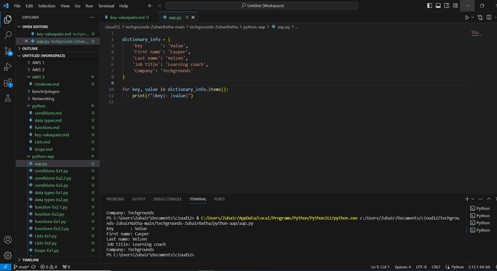
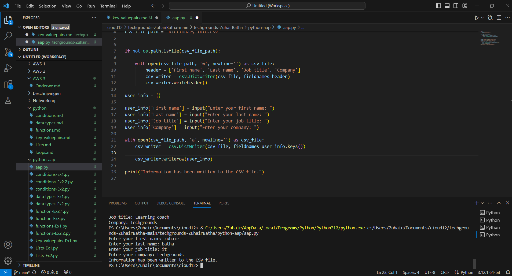

# [key-valuepairs]
[Key-value pairs are a fundamental concept in many programming languages, and they are often associated with data structures like dictionaries or maps. In Python, dictionaries are used to store key-value pairs.]

## Key-terms
[Schrijf hier een lijst met belangrijke termen met eventueel een korte uitleg.]

## Opdracht
# Exercise 1:
 - Create a new script.
 - Create a dictionary with the following keys and values:
 - Loop over the dictionary and print every key-value pair in the terminal.
 # Exercise 2:
 - Create a new script.
 - Use user input to ask for their information (first name, last name, job title, company). Store the information in a dictionary.
 - Write the information to a csv file (comma-separated values). The data should not be overwritten when you run the script multiple times.
### Gebruikte bronnen
[https://www.youtube.com/watch?v=MZZSMaEAC2g]
[https://www.youtube.com/watch?v=0wO3KdJOKN8]
[https://www.youtube.com/watch?v=cVxS5vfu-lQ]

### Ervaren problemen
[geen]

### Resultaat
[gelukt]

