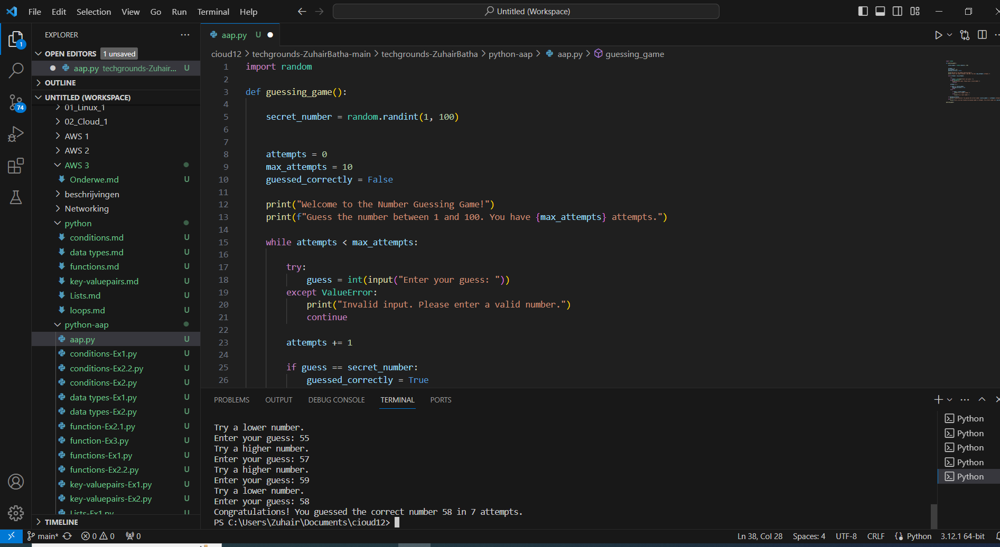

# [miniproject]
[Geef een korte beschrijving van het onderwerp]

## Key-terms
[Schrijf hier een lijst met belangrijke termen met eventueel een korte uitleg.]

## Opdracht
- Number Guessing:
Generate a random number between 1 and 100 (or any other range).
- The player guesses a number. For every wrong answer the player receives a clue.
- When the player guesses the right number, display a score.
### Gebruikte bronnen
[https://www.youtube.com/watch?v=B2tviDGFq84]

### Ervaren problemen
[geen]

### Resultaat
[gelukt]
