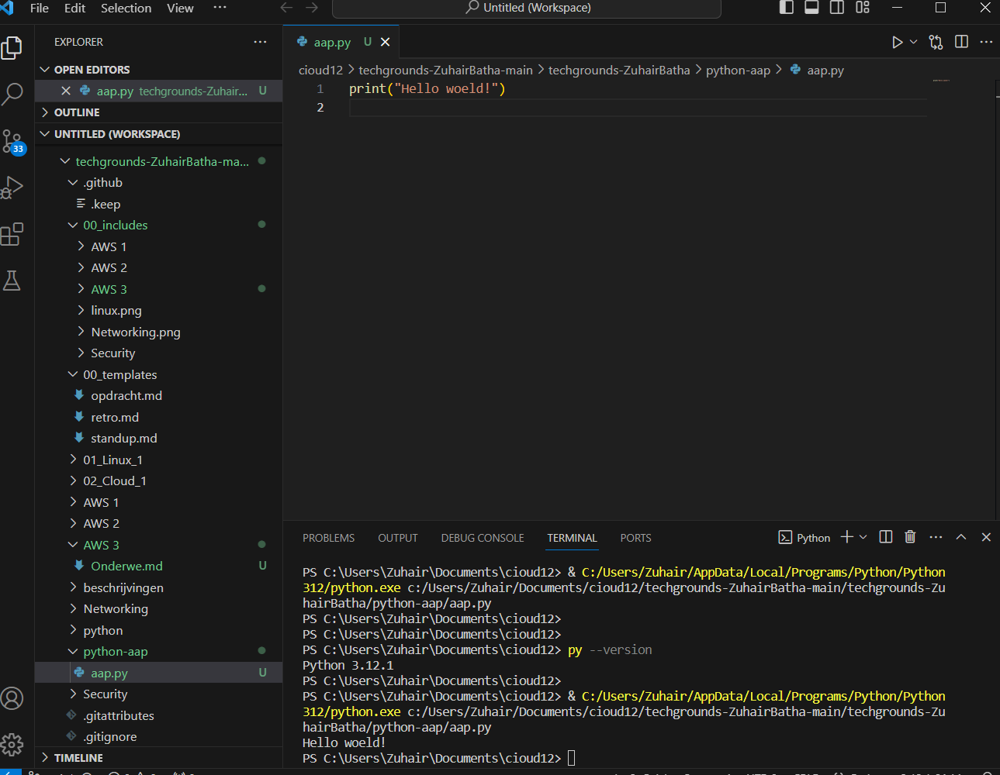

# [setting up]
[Geef een korte beschrijving van het onderwerp]

## Key-terms
[Python, Visual Studio Code]

## Opdracht
# Exercise:
 - Install the latest version of Python from https://www.python.org/
 - Install VS Code from https://code.visualstudio.com/download
 - Install the Python plug-in in VS Code.
 - Write the following Python code. The output in the terminal should be the text “Hello world!”
print("Hello world!")
### Gebruikte bronnen
[https://www.youtube.com/watch?v=WTRKeSoynKI&list=PLuXY3ddo_8nzrO74UeZQVZOb5-wIS6krJ&index=3.]
[https://www.youtube.com/watch?v=oMMW_Cx0qW8&list=PLuXY3ddo_8nzrO74UeZQVZOb5-wIS6krJ&index=5]

### Ervaren problemen
[geen]

### Resultaat
[gelukt]

