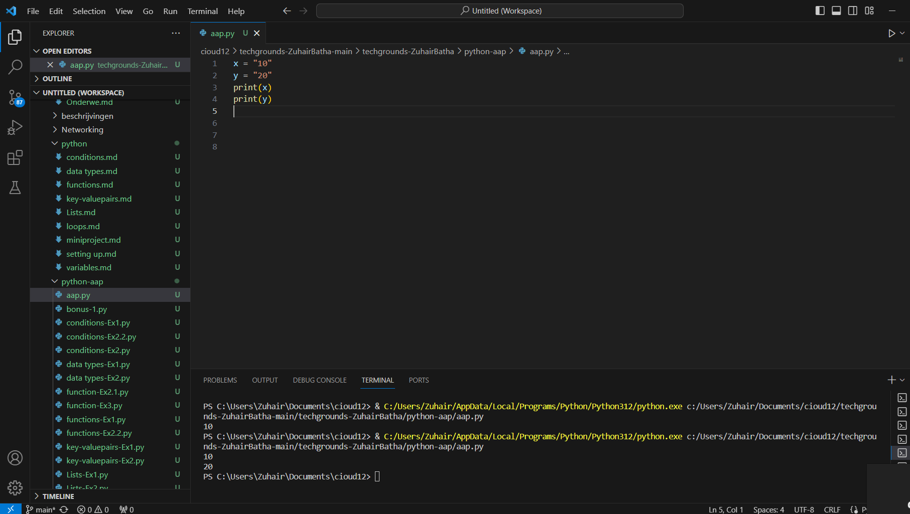
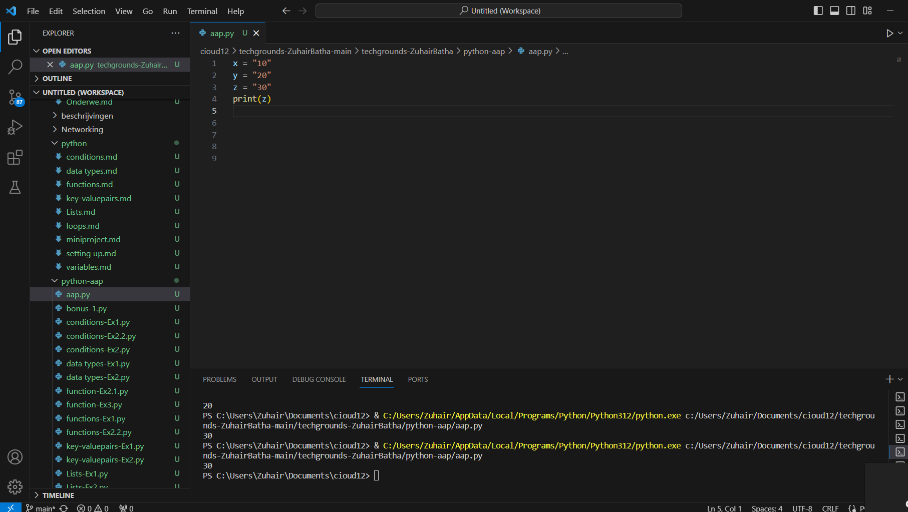
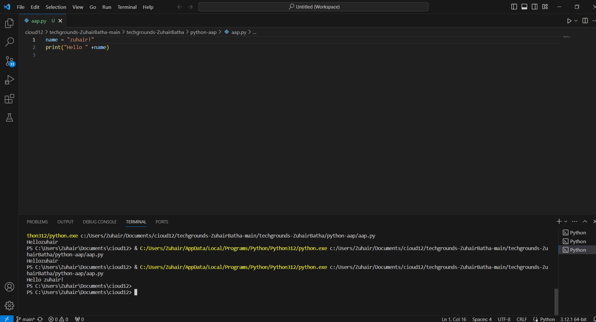
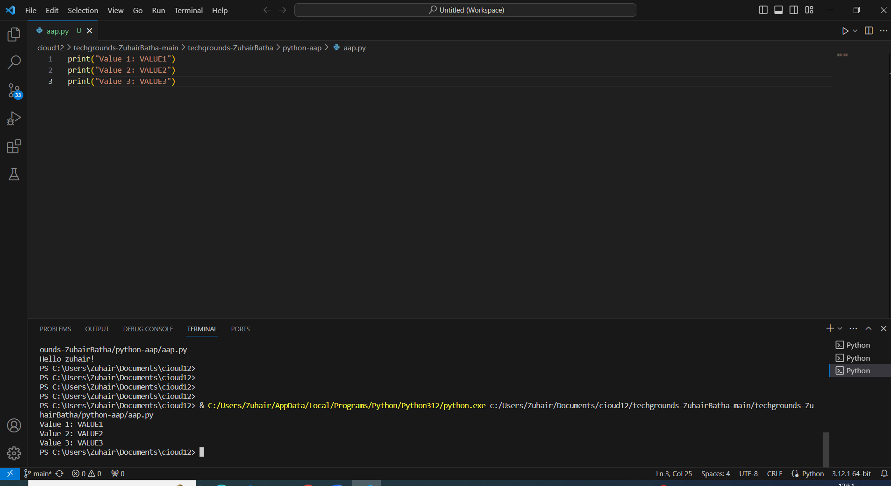
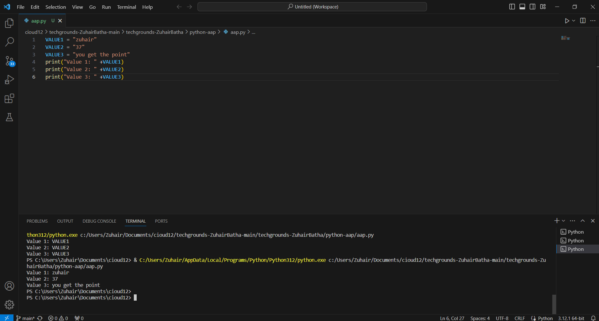

# [variables]
[Variables in Python are used to store and manage data. They are essentially containers that hold values.]

## Key-terms
[Schrijf hier een lijst met belangrijke termen met eventueel een korte uitleg.]

## Opdracht
# Exercise 1:
- Create a new script.
- Create two variables x and y. Assign a numerical value to both variables.
- Print the values of x and y.
- Create a third variable named z. The value of z should be the sum of x and y.
- Print the value of z.
# Exercise 2:
- Create a new script.
- Create a variable called name. The value of name should be your name.
- Print the text “Hello, YOURNAME!”. Use the variable name in the print statement.
# Exercise 3:
- Create a new script.
- Create a variable and assign a value to it.
- Print the text “Value 1: VALUE1”.
- Change the value of that same variable.
- Print the text “Value 2: VALUE2”.
- Change the value of that same variable.
- Print the text “Value 3: VALUE3”.
### Gebruikte bronnen
[https://www.youtube.com/watch?v=LKFrQXaoSMQ]
[https://www.youtube.com/watch?v=gQxch0k9B0E&list=PLuXY3ddo_8nzrO74UeZQVZOb5-wIS6krJ&index=7]

### Ervaren problemen
[geen.]

### Resultaat
[gelukt]

